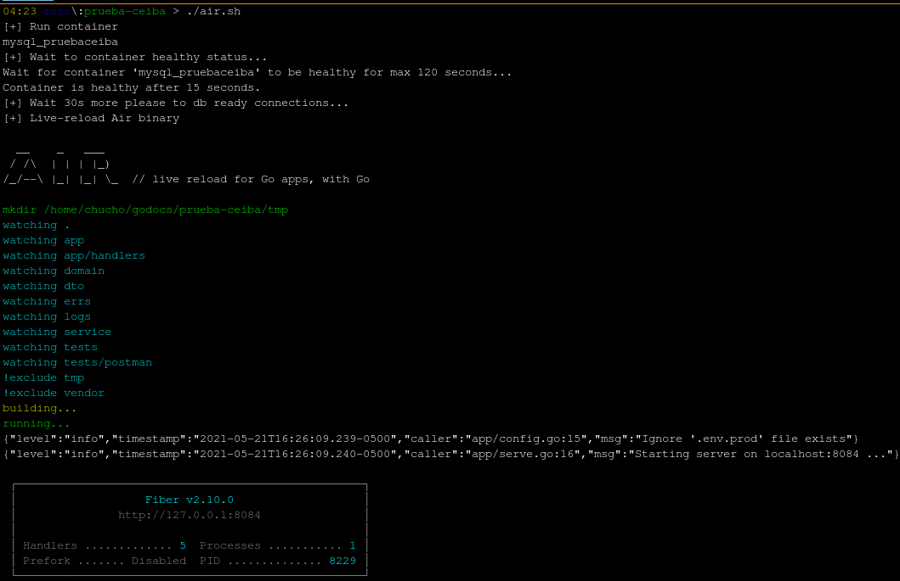
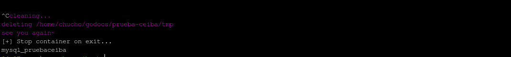
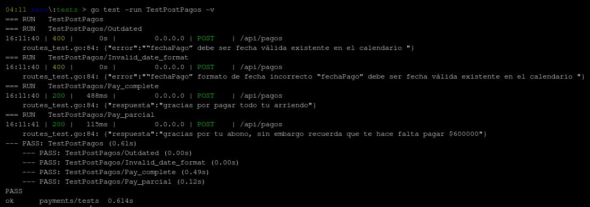

# Prueba ceiba: *API para pagos de arrendamientos*

- Bajar dependencias: `go mod vendor`

- Configuraciones necesarias: `.env`

- Contenedor DB: `docker-compose up -d`

- **Importar DB**: `./db.sh`

- Para iniciar con hot-reload: `air` [Binario: https://github.com/cosmtrek/air]

- Ejecución preparando entorno: `./air.sh`

- Ejecución directa sin esperar instancia db: `go run .`

- **Tests**: `./tests/routes_test.go`

